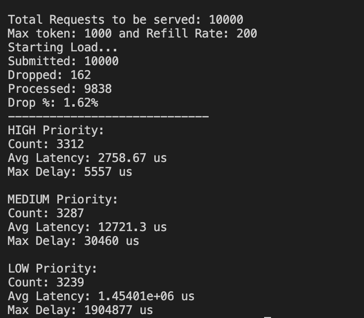
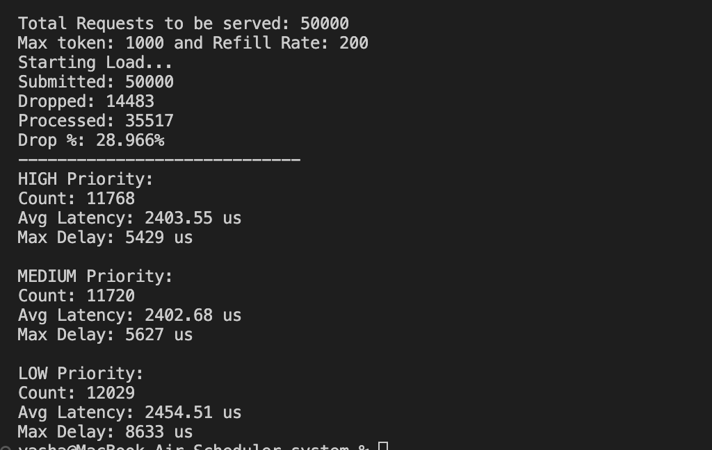
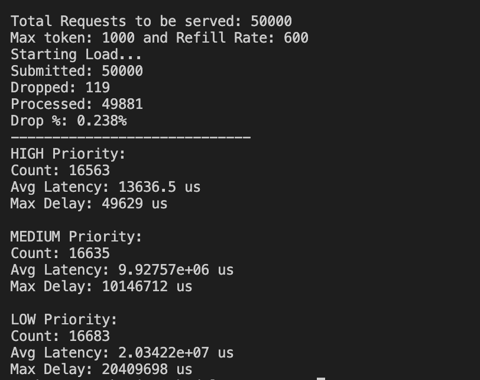

# Distributed Task Scheduler
 
A multi-threaded task scheduling system designed to simulate real world backend behavior under load. It focuses on priority based execution, rate limiting, and controlled load shedding.

---

## Overview

This system processes up to 50,000+ requests using:

- Thread pool based parallel execution  
- Priority scheduling (High, Medium, Low)  
- Token bucket rate limiting (per user)  
- Controlled request dropping under overload  
- Latency and throughput tracking  

---

## Key Features

- **Concurrent Execution** using worker threads and synchronization primitives  
- **Priority Scheduling** ensuring High > Medium > Low execution under contention  
- **Rate Limiting** via token bucket algorithm to prevent overload  
- **Load Shedding** with retry-based admission control  
- **Metrics Tracking** for latency, throughput, and drop rate  

---

## Results

### Balanced Load (Low Drop, Priority Visible)



- Drop: ~1.6%  
- Clear latency separation across priorities  

---

### Overloaded System (High Drop)



- Drop: ~28%  
- Requests dropped early → minimal queueing  

---

### High Throughput (Low Drop, Heavy Queueing)



- Drop: ~0.23%  
- Strong priority impact:
  - High → lowest latency  
  - Low → highest latency  

---

## Key Insights

- Priority scheduling is effective only when queues build up  
- High drop rates reduce scheduling impact  
- System behavior depends on balance between load and capacity  

---

## Tech Stack

- C++
- Multithreading (std::thread, mutex, condition_variable)
- System design concepts (rate limiting, scheduling)

---

## Run

```bash
g++ -std=c++17 main.cpp -o scheduler && ./scheduler
